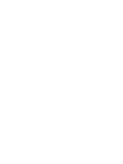

# SVG paths tools

When you're building an animations with SVG it's important to keep amount and
order of the moving point in mind, and that's hard. This tool aims to
automatically adjust some of the paths in the SVG, so the animation doesn't
break. When build manually.

Currently it only works with relative paths, since for absolute paths
correction it needs to track the coordinates of the previous point.

## How to use

`index.js` contains nodejs script to interact with the tools. If nodejs is install:

```sh
node index.js
```

If node is not install, there is a docker option:

```sh
make run
```

Sript will accept two lines with original path and target path, and proves in
reposnse two adjusted paths.

## How does it work

Each path breaking down to commands/tokens according to SVG specification, and
when commands are different and have different amount of points for the resul
image – redundant points are added to the path until both original and target
paths have same amount.

## Example


